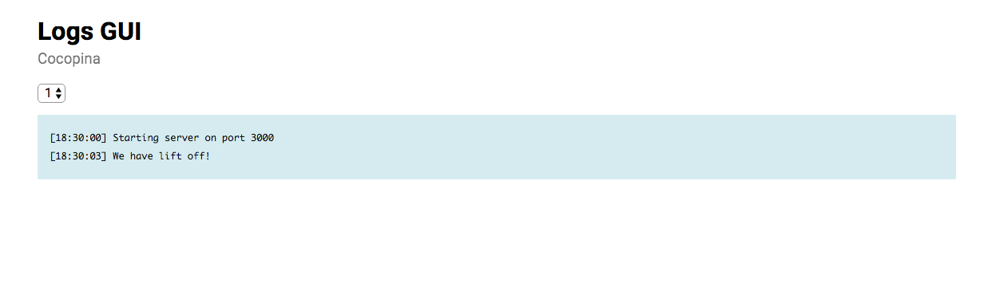

# Logs UI
A simple and clean log files web viewer.

The logs list and the logs content are updated live, using sockets.



## Installation

```sh
$ npm install @cocopina/logs-ui
```

## Usage
Create a configuration file named `.logs.ui.json` or `.logs.ui.js` and place it in the root of your projects.

Add an npm script to your package:
```sh
"logs-ui": "logs-ui"
```

Run:
```sh
$ npm run logs-ui
```

## Configuration

| Parameter | Description | Default |
| --------- | ----------- | ------- |
| `app_name`  | The app's name | -    |
| `logs_dir`  | The directory that holds the logs | **NONE. MANDATORY** |
| `port` | The port to run on | `1095` |

### Example
```json
{
	"app_name": "Cocopina",
	"logs_dir": "./logs",
	"port": "4004"
}
```
